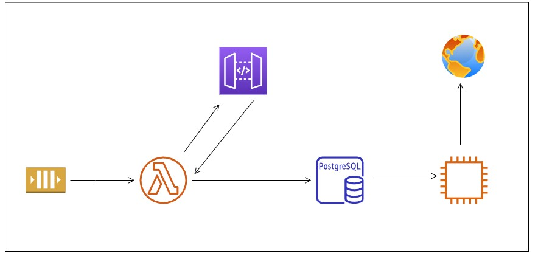

# Minecraft Server Marketplace Tracker

This project pulls data from a Minecraft server's API to track and analyse in-game marketplace trends, helping identify the most profitable items to buy and sell. By considering factors like profit margins, competition, and transaction volumes, it offers valuable insights into the market.

It also records historical prices on an RDS PostgreSQL database to forecast future trends and make smarter buying decisions. The results are displayed on a Streamlit website, where users can interact with tables and graphs powered by pandas, matplotlib and SQL to explore the data in real time.


# How the pipeline works



The data pipeline operates through a series of orchestrated steps, each contributing to the transformation and presentation of Minecraft marketplace data. Below is a breakdown of how the pipeline works:

1. **Event Scheduling with AWS EventBridge**:
    The pipeline is triggered on a schedule via AWS EventBridge, configured to run every 5 minutes. This interval is designed to avoid excessive resource usage, but it can be easily adjusted for more frequent, real-time updates.

2. **Data Collection and Transformation with AWS Lambda**:
    When the Lambda function is invoked by EventBridge, it makes a call to the Minecraft server's API, retrieving all relevant marketplace data. This data is then transformed by generating new metrics that enable detailed analysis of the best products for buying and selling.

3. **Data Storage in PostgreSQL on RDS**:
    After transformation, the processed data is stored in an Amazon RDS database running PostgreSQL, ensuring that all data is safely housed for future analysis and reporting.

4. **Web Interface with EC2**:
    An EC2 instance running Linux hosts a basic website created with Streamlit. The website visualizes the historical data using Matplotlib charts and presents most profitable products in a tabular format using Pandas.

5. **Global Accessibility**:
    The entire setup is accessible via the EC2 instance's public IP, allowing users to view and interact with the data from anywhere in the world.


# Final Product

**Top Products**


The first section of the website displays a chart showing the most profitable items, ranked by **true hourly profit**. This metric considers both the maximum hourly profit and competition. **Maximum hourly profit** is calculated based on the lower value between total buys and sells per hour, then multiplied by the profit per item. **Competition** is factored in by assessing the imbalance between the number of buyers and sellers, adjusting the profit accordingly. Other key metrics include current **buy** and **sell prices**, along with **profit per item**. Flipping items in this game operates through buy and sell orders, and securing these orders is highly competitive, as many other players are pursuing the same goals. This section highlights the most worthwhile products to focus on.


**Historic Prices**


This section lets you select any product from the marketplace via a dropdown menu, instantly displaying its historic buy and sell prices, all powered by data stored in RDS. While the pipeline needs to run longer to capture more trends, it’s an invaluable tool for long-term flips. You can place buy and sell orders with confidence, anticipating that they’ll fill over time, rather than going for quick flips like the previous top products chart prioritises.


**Features To Add**

Some potential long-term features to enhance this project could include calculating the most profitable items to craft, taking into account the total cost of raw materials needed to produce the finished product on the marketplace. Additionally, it would be valuable to track the profit margins for each item based on both sell orders and instant sells. While instant sells tend to be less profitable, they offer the advantage of not having to wait or compete in the market.


# How to set up

**AWS Account Setup**
Ensure your AWS account is set up, and that a User role with permissions to create services is created. Then, configure your CLI to connect to AWS by running:

```bash
aws configure
```
Retrieve your credentials from your AWS user account.

**Edit Configuration Files**
Edit the deploy and cloudformation files to set your custom names for the S3 bucket and EC2 key name. Ensure that you change all instances of the old names in links and variables within the CloudFormation file to ensure all dependencies match.
Alternatively, you can leave the default values as they are, and the services will be named accordingly.

**API Key Setup**
You will need to add your own API key in the lambda_function.py file. This can be obtained by creating an account on the Minecraft servers website. For demonstration purposes, an API key is currently included in the example.

**Install Dependencies**
Download all required packages listed in requirements.txt and place them in a python folder by running the following command:

```bash
pip install -r requirements.txt --target=./python
```
**Create ZIP Files**

Zip everything except the python folder into a file named lambda_function.zip.

Then, zip the python folder into a file called packages.zip.

**Deploy the Stack**

While in the root directory of the repository, run:

```bash
./deploy.sh
```
This will deploy the CloudFormation stack.

**Handle Errors and Redeployment**
If you encounter errors or need to redeploy, make sure to manually delete the S3 bucket, EC2 key pairs, .pem file created in your root directory, and VPCs on AWS. These resources will not be automatically removed when deleting the stack.

**Set Up EventBridge Scheduler**
Once the stack has been uploaded, you will need to manually set up the EventBridge scheduler as a trigger for the Lambda function. This is not done automatically by the CloudFormation template to avoid wasting resources unknowingly. You can set the interval to whatever you prefer (e.g., every 1 second or every 10 minutes).

**Access the Website**
After the first Lambda invocation, you can access the website with the data. Find your EC2 instance's public IP address and connect to it using port 8501, for example:

```bash
https://12.345.678:8501
```